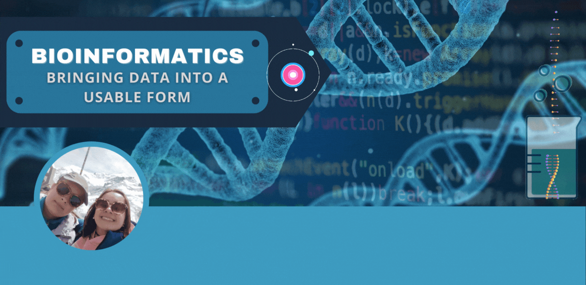

<h1>ipopa1995</h1>
<h2>Welcome to my GitHub Profile!</h2>

<h3>About Me</h3>

  I am passionate about technology, programming, and exploring innovative solutions to real-world problems.
  With a strong background in Bioinformatics and Data Science, I strive to create high-quality software and contribute to open source projects.

<h3>Education</h3>
<ul>
  <li>
    <strong>Master's Degree in Bioinformatics</strong> (10/2018 - 03/2021) - Goethe University Frankfurt am Main
  </li>
  <li>
    <strong>Bachelor's Degree in Applied Bioinformatics</strong> (09/2014 - 06/2018) - Technical University Bingen am Rhein
  </li>
  <li>
    <strong>High School</strong> (2006 - 2014) - Heinrich-Heine-Gymnasium Nellingen
  </li>
  <li>
    <strong>Elementary School</strong> (2002 - 2006) - Lindenschule Parksiedlung
  </li>
</ul>

<h3>Professional Experience</h3>
<ul>
  <li>
    <strong>Scientific Assistant</strong> (08/2021 - Present) - Institute for Clinical Chemistry, University Medical Center Göttingen 
    Project: CovidCrawler - AI-NET Protect and GWDG
  </li>
  <li>
    <strong>Internship</strong> (04/2020 - 07/2020) - Department of Computer Science, Goethe University Frankfurt am Main
  </li>
  <li>
    <strong>Research Internship</strong> (02/2020 - 04/2020) - Molecular Bioinformatics Group (MolBI), Goethe University Frankfurt am Main
  </li>
  <li>
    <strong>Internship</strong> (10/2019 - 01/2020) - Department of Applied Bioinformatics, Goethe University Frankfurt am Main
  </li>
  <li>
    <strong>Internship</strong> (04/2019 - 09/2019) - Department of Computer Science, Goethe University Frankfurt am Main
  </li>
  <li>
    <strong>Practical Phase</strong> (11/2017 - 04/2018) - Department of Radiotherapy and Oncology, Mainz University Medical Center
  </li>
  <li>
    <strong>Internship</strong> (03/2017 - 06/2017) - Genetic Engineering S1 Laboratory, Technical University Bingen am Rhein
  </li>
  <li>
    <strong>Internship</strong> (11/2016 - 02/2017) - Department of Applied Bioinformatics, Technical University Bingen am Rhein
  </li>
</ul>

<h3>Research Studies</h3>
<ul>
  <li>
    <strong>KnowVID-19: An artificially intelligent knowledge-based system for COVID-19 to extract targeted information from online medical repositories</strong> 
    Authors: Ioana Popa, Muzzamil Aziz, Amjad Zia, Sabih Ahmed Khan, Amirreza Fazely Hamedani, Abdul R. Asif 
    Year: 2023 (not published yet)
  </li>
  <li>
    <strong>Artificial Intelligence-Based Medical Data Mining</strong> 
    Authors: Amjad Zia, Muzzamil Aziz, Ioana Popa, Sabih Ahmed Khan, Amirreza Fazely Hamedani, Abdul R. Asif 
    Published in: J. Pers. Med. 2022, Volume 12, Issue 9, 1359 
    Date: 24.08.2022
  </li>
</ul>

<h3>Skills</h3>

<h4>Languages</h4>
<ul>
  <li>German, English, Romanian</li>
</ul>

<h4>Programming Languages</h4>

<h4>Web Technologies</h4>

<h4>Databases</h4>

<h4>Python Libraries</h4>

<h4>Tools</h4>

<h4>Operating Systems</h4>

<h4>Prototyping Platform</h4>

<h4>Office</h4>

<h2>GitHub Stats</h2>

