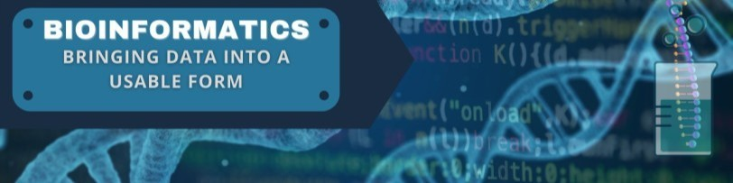

<!--
**ipopa1995/ipopa1995** is a ✨ _special_ ✨ repository because its `README.md` (this file) appears on your GitHub profile.

Here are some ideas to get you started:

- 🔭 I’m currently working on ...
- 🌱 I’m currently learning ...
- 👯 I’m looking to collaborate on ...
- 🤔 I’m looking for help with ...
- 💬 Ask me about ...
- 📫 How to reach me: ...
- 😄 Pronouns: ...
- ⚡ Fun fact: ...
-->

# ipopa1995

Welcome to my GitHub Profile!

## About Me

I am passionate about technology, programming, and exploring innovative solutions to real-world problems. With a strong background in Bioinformatics and DataSience,
I strive to create high-quality software and contribute to open source projects.

## Personal Information
- **Name:** Ioana Popa
- **Date/Place of Birth:** 23.01.1995 / Bacău
- **Mobile:** 0176-42608268
- **Email:** ioana@popa-online.de
- **LinkedIn:** [ioana-popa-31a96a171](https://www.linkedin.com/in/ioana-popa-31a96a171)
- **Xing:** [Ioana_Popa9](https://www.xing.com/profile/Ioana_Popa9/cv)
- **Nationality:** German

## Education
- **Master's Degree in Bioinformatics** (10/2018 - 03/2021)  
Goethe University Frankfurt am Main  
- **Bachelor's Degree in Applied Bioinformatics** (09/2014 - 06/2018)  
Technical University Bingen am Rhein  
- **High School** (2006 - 2014)  
Heinrich-Heine-Gymnasium Nellingen  
- **Elementary School** (2002 - 2006)  
Lindenschule Parksiedlung

## Professional Experience
- **Scientific Assistant** (08/2021 - Present)  
Institute for Clinical Chemistry, University Medical Center Göttingen  
Project: CovidCrawler - AI-NET Protect and GWDG  
- **Internship** (04/2020 - 07/2020)  
Department of Computer Science, Goethe University Frankfurt am Main  
- **Research Internship** (02/2020 - 04/2020)  
Molecular Bioinformatics Group (MolBI), Goethe University Frankfurt am Main  
- **Internship** (10/2019 - 01/2020)  
Department of Applied Bioinformatics, Goethe University Frankfurt am Main  
- **Internship** (04/2019 - 09/2019)  
Department of Computer Science, Goethe University Frankfurt am Main  
- **Practical Phase** (11/2017 - 04/2018)  
Department of Radiotherapy and Oncology, Mainz University Medical Center  
- **Internship** (03/2017 - 06/2017)  
Genetic Engineering S1 Laboratory, Technical University Bingen am Rhein  
- **Internship** (11/2016 - 02/2017)  
Department of Applied Bioinformatics, Technical University Bingen am Rhein

## Research Studies
- **KnowVID-19: An artificially intelligent knowledge-based system for COVID-19 to extract targeted information from online medical repositories**  
Authors: Ioana Popa, Muzzamil Aziz, Amjad Zia, Sabih Ahmed Khan, Amirreza Fazely Hamedani, Abdul R. Asif  
Year: 2023

- **Artificial Intelligence-Based Medical Data Mining**  
Authors: Amjad Zia, Muzzamil Aziz, Ioana Popa, Sabih Ahmed Khan, Amirreza Fazely Hamedani, Abdul R. Asif  
Published in: J. Pers. Med. 2022, Volume 12, Issue 9, 1359  
Date: 24.08.2022

## Skills
### Languages
- German (fluent, spoken & written)
- English (fluent, spoken & written)
- Romanian (native language)

### Programming Languages
- Python, Java, Perl, C++

### Scripting Languages
- JavaScript, ImageJ

### Web Technologies
- HTML, CSS, XML, XSLT, JSON

### Databases
- SQLite, MySQL

## Personal Strengths
Initiative, reliability, willingness to participate, teamwork, and willingness to learn

## Interests and Hobbies
Badminton, diving, reading, music

# GitHUB STATS

